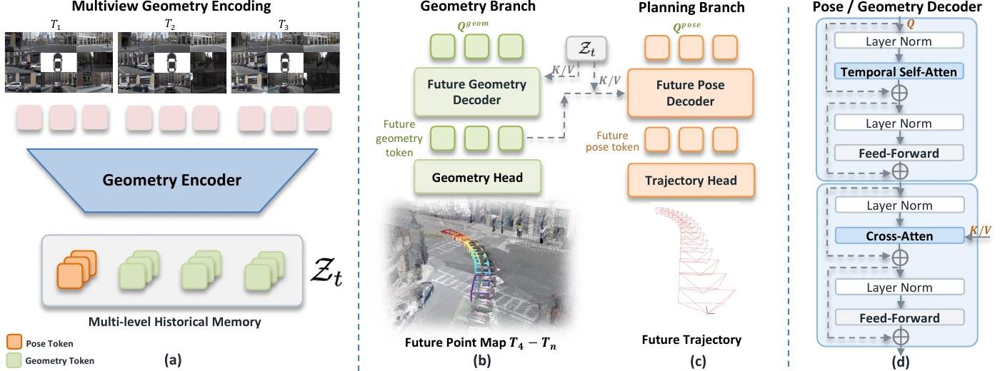

# GeoWAM: Visual Geometry World Action Models for Autonomous Driving

[**Project Page**](https://yiren-lu.com/project_pages/GeoWAM/) | [**arXiv**](https://arxiv.org/abs/2608.23486)

---

## 🚧 Code Coming Soon

The code and models for GeoWAM will be released here. Stay tuned!

GeoWAM is a visual geometry world action model for autonomous driving. Rather than predicting future images, GeoWAM is pretrained to forecast future 3D scene geometry, and a geometry-conditioned action head then leverages these learned geometric dynamics to predict future ego trajectories. GeoWAM achieves a combined EPDMS of 39.6 on NAVSIM `navhard` without PDMS supervision and a 0.12% collision rate in zero-shot planning on nuScenes, and its planning performance keeps improving as geometry pretraining scales with unlabeled driving data.

<p align="center">
  
</p>

## Citation

```bibtex
@article{lu2026geowam,
  title={GeoWAM: Visual Geometry World Action Models for Autonomous Driving},
  author={Lu, Yiren and Ye, Xin and Liu, Jiaming and Jacobson, Philip and Yao, Jin and Chen, Yi-chung and Merino, Liam and Kurra, Dhruva Dixith and Cai, Min and Lampo, Tom and others},
  journal={arXiv preprint arXiv:2608.23486},
  year={2026}
}
```
